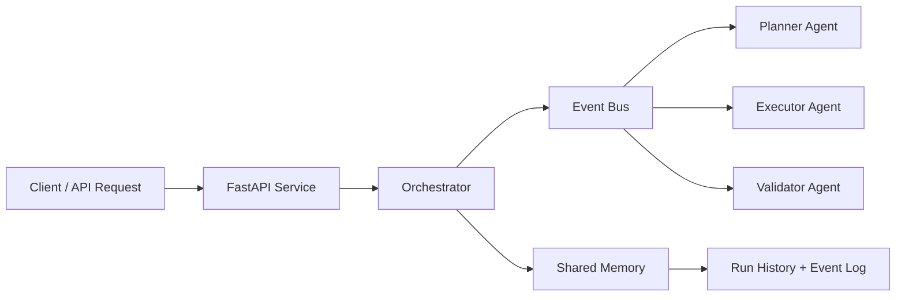
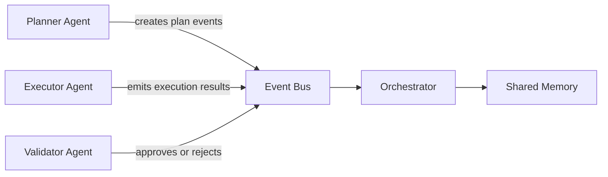

# Architecture Diagram - Day 2

## Event-Driven Architecture

## Agent Responsibility View

## Day 2 Notes

- the event bus decouples workflow transitions from direct method chaining
- each run now stores an event history for replay and debugging
- validation failure triggers a new execution event instead of a raw loop-only flow
- shared memory is still file-based now, but it can evolve to Redis or Postgres in Day 3
