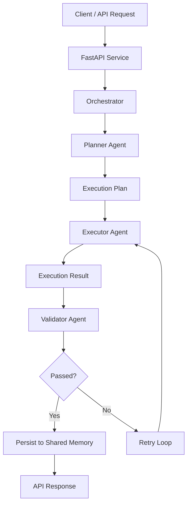
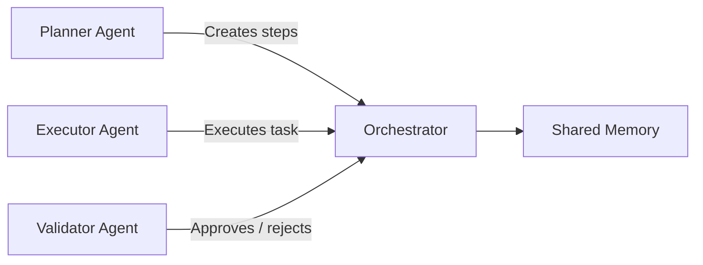
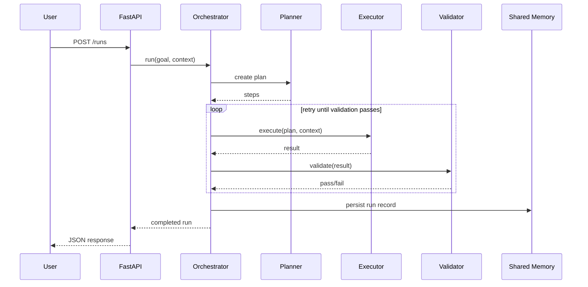

# Architecture Diagram - Day 1

## High-Level Flow

## Agent Responsibilities

## Sequence Diagram

## Day 1 Architectural Notes

- Planner, Executor, and Validator are separated to show clear role-based agents.
- Shared memory is intentionally simple now, but can evolve to Redis, Postgres, or a vector store.
- Retry loop is in the orchestrator to centralize control logic.
- FastAPI gives an API-first interface and makes the project demo-friendly.

## Day 2 Evolution

- add async execution
- add queue or event bus
- add structured logging
- add metrics endpoint

## Day 3 Evolution

- add Docker Compose and Kubernetes manifests
- add Prometheus / Grafana
- add deployment workflow

