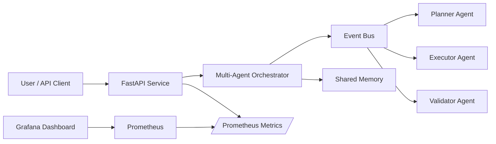
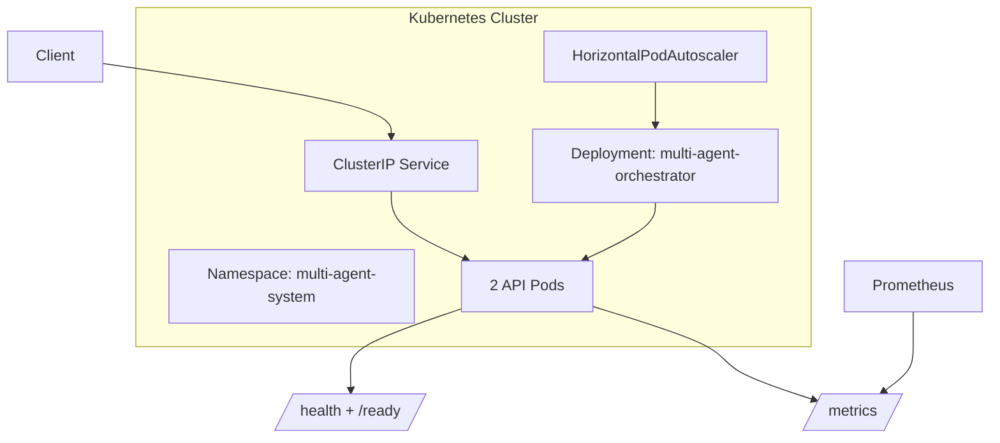

# Day 3 — Kubernetes + Observability

Day 3 turns the event-driven multi-agent runtime into a production-style platform component.

## What was added

- Docker runtime
- Docker Compose local stack
- Prometheus metrics endpoint: `/metrics`
- Grafana dashboard provisioning
- Kubernetes manifests
- readiness and liveness probes
- structured JSON logs
- CI-friendly tests for observability endpoints

## Runtime Architecture



## Kubernetes View



## Metrics exposed

- `multi_agent_runs_total{status="completed|failed"}`
- `multi_agent_events_total{event_type="...", source="..."}`
- `multi_agent_agent_execution_seconds_bucket{agent="planner|executor|validator"}`
- `multi_agent_run_duration_seconds_bucket`
- `multi_agent_active_runs`

## Local observability stack

```bash
docker compose up --build
```

Open:

- API docs: `http://localhost:8000/docs`
- Prometheus: `http://localhost:9090`
- Grafana: `http://localhost:3000`

Grafana login:

- username: `admin`
- password: `admin`
