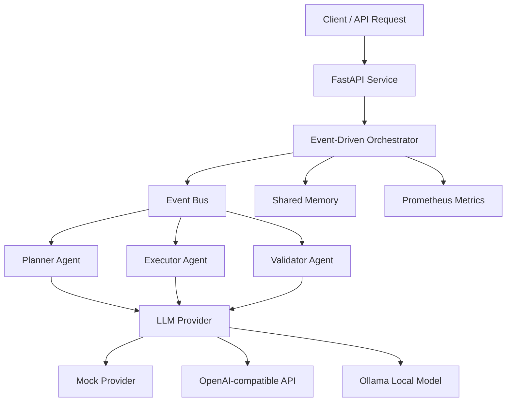

# Day 4 — LLM-Powered Agents

Day 4 closes the project by upgrading the agents from deterministic rule-based components to an LLM-powered architecture with safe local defaults.

## What changed

- Added an LLM provider abstraction
- Added mock, OpenAI-compatible, and Ollama providers
- Planner Agent can generate plans through an LLM interface
- Executor Agent can produce LLM-assisted execution results
- Validator Agent can make retry/pass decisions through LLM reasoning
- Added prompt templates for each agent role
- Kept the default provider as `mock` so tests and CI never require external API keys

## Provider modes

```text
LLM_PROVIDER=mock    -> deterministic local behavior, CI-safe
LLM_PROVIDER=openai  -> OpenAI-compatible chat completions API
LLM_PROVIDER=ollama  -> local Ollama model via /api/generate
```

## Architecture



## Design principle

The system does not depend directly on a single LLM vendor. Agents depend on an `LLMClient` interface, and the provider is selected at runtime through environment variables.

This keeps the runtime:

- testable
- portable
- CI-safe
- cloud-ready
- local-first friendly

## Example OpenAI configuration

```bash
export LLM_PROVIDER=openai
export OPENAI_API_KEY="your-key"
export OPENAI_MODEL="gpt-4o-mini"
uvicorn app.main:app --reload
```

## Example Ollama configuration

```bash
ollama run llama3.1
export LLM_PROVIDER=ollama
export OLLAMA_MODEL=llama3.1
uvicorn app.main:app --reload
```

## Default local mode

No configuration is required for local tests:

```bash
pytest
```

The project defaults to:

```bash
LLM_PROVIDER=mock
```
