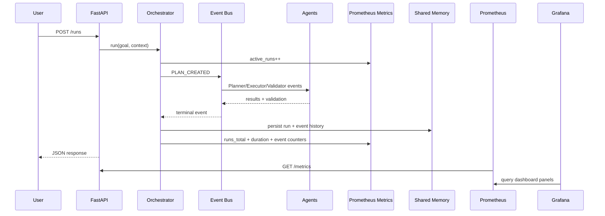

# Day 3 Sequence — Request + Metrics

```mermaid
sequenceDiagram
    participant User
    participant API as FastAPI
    participant Orch as Orchestrator
    participant Bus as Event Bus
    participant Agent as Agents
    participant Metrics as Prometheus Metrics
    participant Memory as Shared Memory
    participant Prom as Prometheus
    participant Grafana

    User->>API: POST /runs
    API->>Orch: run(goal, context)
    Orch->>Metrics: active_runs++
    Orch->>Bus: PLAN_CREATED
    Bus->>Agent: Planner/Executor/Validator events
    Agent-->>Bus: results + validation
    Bus-->>Orch: terminal event
    Orch->>Memory: persist run + event history
    Orch->>Metrics: runs_total + duration + event counters
    API-->>User: JSON response

    Prom->>API: GET /metrics
    Grafana->>Prom: query dashboard panels
```
