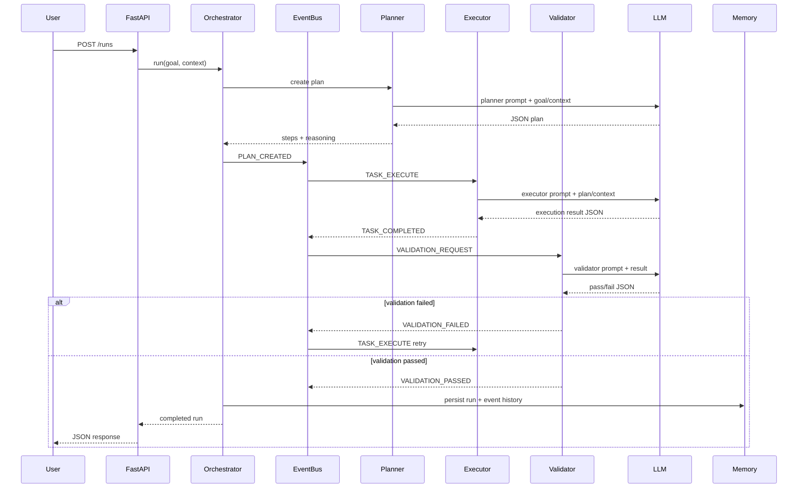

# Day 4 — LLM Agent Sequence

```mermaid
sequenceDiagram
    participant User
    participant FastAPI
    participant Orchestrator
    participant EventBus
    participant Planner
    participant Executor
    participant Validator
    participant LLM
    participant Memory

    User->>FastAPI: POST /runs
    FastAPI->>Orchestrator: run(goal, context)
    Orchestrator->>Planner: create plan
    Planner->>LLM: planner prompt + goal/context
    LLM-->>Planner: JSON plan
    Planner-->>Orchestrator: steps + reasoning

    Orchestrator->>EventBus: PLAN_CREATED
    EventBus->>Executor: TASK_EXECUTE
    Executor->>LLM: executor prompt + plan/context
    LLM-->>Executor: execution result JSON
    Executor-->>EventBus: TASK_COMPLETED

    EventBus->>Validator: VALIDATION_REQUEST
    Validator->>LLM: validator prompt + result
    LLM-->>Validator: pass/fail JSON

    alt validation failed
        Validator-->>EventBus: VALIDATION_FAILED
        EventBus->>Executor: TASK_EXECUTE retry
    else validation passed
        Validator-->>EventBus: VALIDATION_PASSED
        Orchestrator->>Memory: persist run + event history
        Orchestrator-->>FastAPI: completed run
        FastAPI-->>User: JSON response
    end
```
