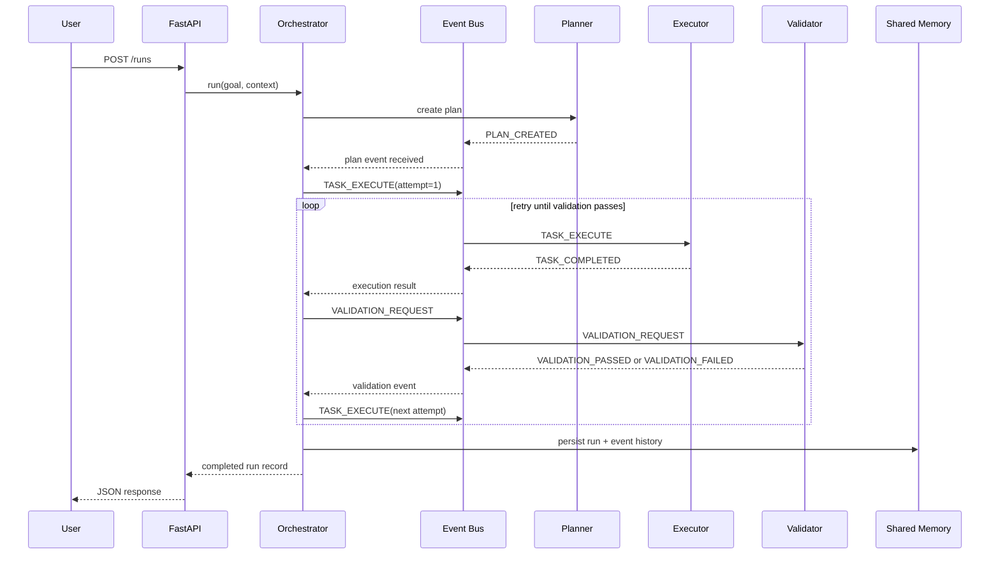

# Sequence Diagram - Day 2

Use this as the first LinkedIn screenshot.

```mermaid
sequenceDiagram
    participant U as User
    participant API as FastAPI
    participant ORC as Orchestrator
    participant BUS as Event Bus
    participant P as Planner
    participant E as Executor
    participant V as Validator
    participant MEM as Shared Memory

    U->>API: POST /runs
    API->>ORC: run(goal, context)
    ORC->>P: create plan
    P-->>BUS: PLAN_CREATED
    BUS-->>ORC: plan event received
    ORC->>BUS: TASK_EXECUTE(attempt=1)

    loop retry until validation passes
        BUS->>E: TASK_EXECUTE
        E-->>BUS: TASK_COMPLETED
        BUS-->>ORC: execution result
        ORC->>BUS: VALIDATION_REQUEST
        BUS->>V: VALIDATION_REQUEST
        V-->>BUS: VALIDATION_PASSED or VALIDATION_FAILED
        BUS-->>ORC: validation event
        ORC->>BUS: TASK_EXECUTE(next attempt)
    end

    ORC->>MEM: persist run + event history
    ORC-->>API: completed run record
    API-->>U: JSON response
```
